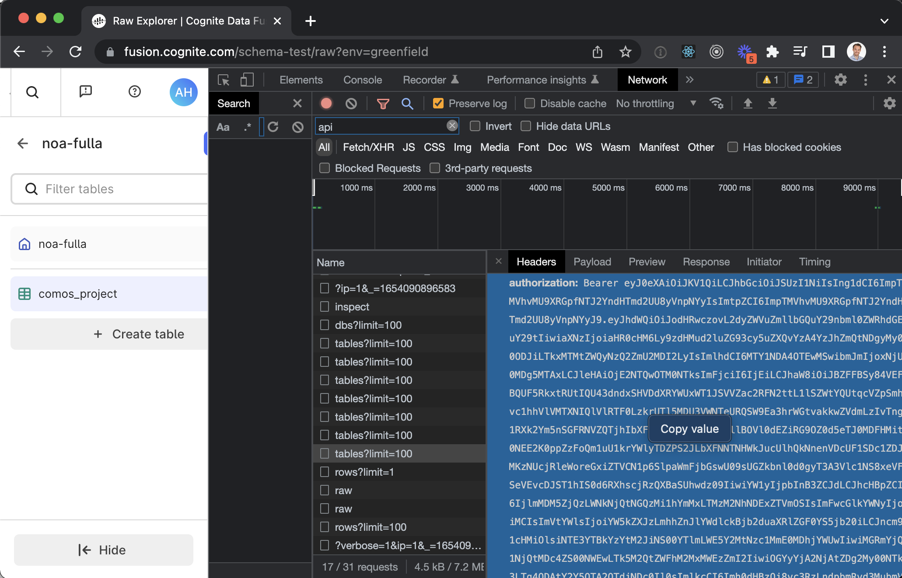

# FDM example

## Prerequisites 
You need [Node.js](https://nodejs.org/en/)

### Install dependencies
Run `npm install`

### CDF token
To run the code below, you will need an environment variable `CDF_TOKEN` that you can find from a network request in Chrome (go into Fusion and fetch the RAW databases for instance):

and set the environment variable by running

`export CDF_TOKEN="Bearer eyJ0eXAiOiJKV1QiLC..."` 
This token is valid around 1 hour I think.

## Creating the data model
The data model is found in the folder `simple`. The name of this folder should match the variable `space` in `index.js`, and also the space used in the data model files (see the files in `simple`). This should to be consistent across all files. Sorry for not automating this!

The data model is divided into three files (in the `simple` folder).
 - `storage.json` is the file describing the data model for the DMS (data model storage) API. See the [docs](https://pr-ark-codegen-1702.specs.preview.cogniteapp.com/v1.json.html#tag/Data-model-management) for syntax.
 - `apiSpec_v1.graphql` is the GraphQL API spec.
 - `manifest.json` defines the version of the API and the bindings between types in GraphQL and corresponding models in DMS. For this example, there is a one to one mapping between the names.

In the `storage.json` folder, you will see the `spaceExternalId` having the value `simple`. In the `manifest.json`, `simple` is also used in each binding as the space.

TL;DR: Look at the files in `simple`. Note that the space name (in this case `simple`) must be the same across all files + name of that directory.

## Ingesting data
CDF transformations are not ready yet, so this example uses the ingest API directly. Look at the file `simple/data.json`. 

## Running the whole thing
Just run the command
`node index.js`

which will do everything from the files above.

## Known issues:
 - You cannot delete spaces or models. Solution if you mess up is to create a new space.
 - The data model cannot be huge yet (100+ types)
 - User experience is bad (yep, but will be great)